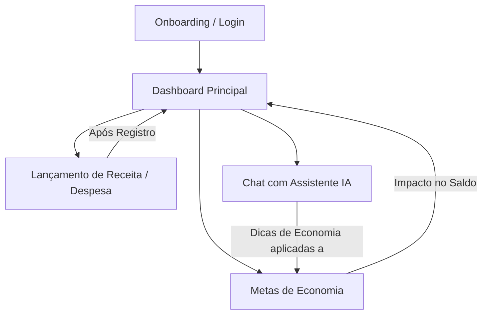
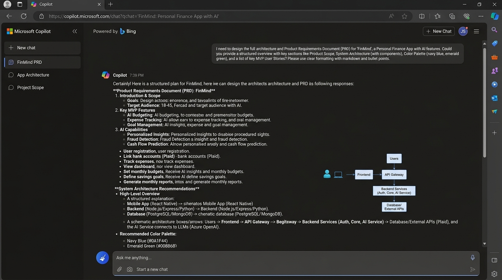
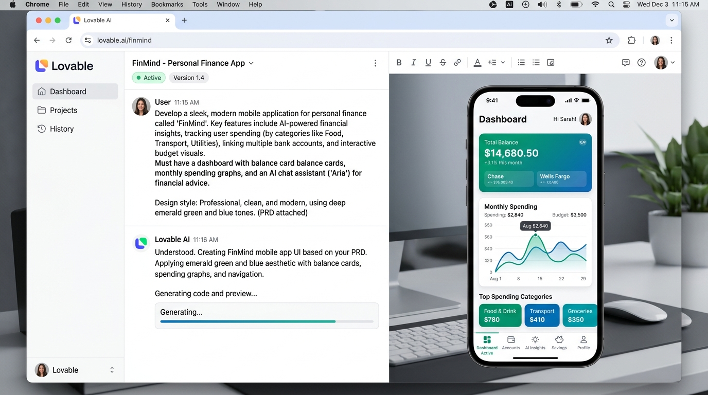

# FinMind — App de Organização de Finanças Pessoais com IA

> Projeto desenvolvido como entrega do desafio **"Criando um App de Organização de Finanças Pessoais com Vibe Coding"** da [Digital Innovation One (DIO)](https://www.dio.me/).

---

## 💡 Conceito

O **FinMind** nasce da necessidade de quebrar a maior barreira enfrentada pelas pessoas no controle financeiro: o cansaço e a fricção gerados por planilhas complexas e formulários repetitivos. Em vez de cobrar disciplina mecânica do usuário, o FinMind transforma a relação com o dinheiro em uma rotina leve, dinâmica e humanizada, conduzida por interações naturais e fluidas.

O **público-alvo** é formado por jovens profissionais, universitários em início de carreira e trabalhadores autônomos ou CLT que buscam independência e previsibilidade financeira. Esse perfil demanda agilidade: eles operam em rotinas aceleradas, priorizam soluções *mobile-first* e precisam de respostas rápidas sobre para onde seu dinheiro está indo, sem gastar horas tabulando extratos bancários.

O **grande diferencial da IA** no FinMind vai além do mero agrupamento de números. O app atua como um mentor financeiro ativo e amigável: através de um assistente integrado via chat, o sistema analisa hábitos de consumo, lê comprovantes instantaneamente via visão computacional (OCR), detecta anomalias em relação à média histórica e sugere planos de economia personalizados e acionáveis para que o usuário atinja metas reais de vida com tranquilidade.

---

## 🎯 Funcionalidades

- **Registro Inteligente de Receitas e Despesas**: Cadastro simplificado por categorias (Alimentação, Transporte, Lazer, Moradia, etc.), permitindo tanto inserção manual instantânea quanto captura e leitura automática via foto de comprovante/recibo.
- **Dashboard Visual e Analítico**: Visão geral da saúde financeira com gráficos dinâmicos de gastos categorizados e filtros por períodos (semanal, mensal e anual).
- **Assistente de IA em Chat**: Conversação em linguagem natural capaz de responder consultas contextuais (ex.: *"Quanto gastei com delivery este mês?"* ou *"Posso jantar fora no fim de semana sem estourar o orçamento?"*) e sugerir estratégias de economia baseadas no histórico.
- **Alertas Inteligentes de Gastos**: Monitoramento proativo que sinaliza quando o consumo em determinada categoria ultrapassa a média histórica ou a meta estabelecida.
- **Metas de Economia com Acompanhamento**: Criação de objetivos financeiros (ex.: Reserva de Emergência, Viagem, Reforma) acompanhados por barras de progresso visuais e celebrações de marcos conquistados.

### 🗺️ Fluxo de Telas e Navegação



### 🧩 Estrutura de Componentes Principais

- `OnboardingView`: Tela de boas-vindas, apresentação de benefícios e autenticação rápida.
- `DashboardView`:
  - `BalanceCard`: Saldo atual, total de receitas e total de despesas do mês.
  - `SpendingChart`: Gráfico de rosca/barras interativo por categorias e períodos.
  - `RecentTransactionsList`: Extrato resumido das últimas movimentações.
  - `SmartAlertBanner`: Cartão dinâmico com notificações e alertas da IA.
- `TransactionModal / TransactionView`:
  - `ReceiptScanner`: Módulo de câmera/upload com OCR de comprovantes.
  - `ManualForm`: Seletor de valor, tipo, categoria, data e observação.
- `AIChatView`:
  - `MessageThread`: Histórico de mensagens e insights gerados.
  - `QuickPromptsCarousel`: Botões com perguntas frequentes pré-configuradas.
  - `ChatInputBar`: Campo de entrada de texto e voz com envio contextual.
- `GoalsView`:
  - `GoalCard`: Card de cada meta com barra de progresso percentual e data estimada.
  - `NewGoalDialog`: Formulário de criação de nova meta e plano sugerido pela IA.

---

## 🧠 Prompt Final (PRD)

Abaixo está o **Product Requirements Document (PRD)** refinado e estruturado, utilizado para alimentar ferramentas de desenvolvimento orientado por IA (como Microsoft Copilot e Lovable):

```text
Crie um app de organização de finanças pessoais chamado FinMind.

CONTEXTO
Um app para jovens profissionais organizarem suas finanças sem depender de 
planilhas complicadas, com apoio de um assistente de IA que interpreta hábitos 
financeiros e sugere ajustes.

FUNCIONALIDADES
1. Cadastro de receitas e despesas, com categorização (alimentação, transporte, 
   lazer, moradia, etc.), podendo adicionar manualmente ou via foto de comprovante.
2. Dashboard com gráficos de gastos por categoria e por período (mês, semana).
3. Assistente de IA em formato de chat, que responde perguntas sobre os gastos 
   do usuário (ex: "quanto gastei com delivery esse mês?") e sugere metas de 
   economia personalizadas com base no histórico.
4. Sistema de alertas inteligentes que avisa quando uma categoria de gasto está 
   acima da média histórica do usuário.
5. Definição de metas de economia com barra de progresso visual.

DESIGN
Interface limpa e moderna, cores que transmitam confiança e tranquilidade 
(tons de azul e verde), tipografia clara, mobile-first.

TELAS NECESSÁRIAS
- Onboarding/login
- Dashboard principal (resumo financeiro + gráficos)
- Tela de lançamento de receita/despesa
- Chat com o assistente de IA
- Tela de metas de economia

Gere a estrutura de componentes e o fluxo de navegação entre essas telas.
```

---

## 🖼️ Interações com Copilot / Lovable

### 1. Concepção e Arquitetura no Copilot
O prompt acima foi submetido ao Copilot para validação de escopo, enriquecimento da experiência do usuário e geração das regras de negócio do agente financeiro.

**Exemplo de resposta obtida da IA:**
> *"Para o FinMind, recomendo adotar uma paleta com Azul Profundo (#0F172A) para solidez, Verde Esmeralda (#10B981) para saldo e rendimentos, e detalhes em Menta Suave para tranquilidade visual. O fluxo deve priorizar a navegação inferior (Bottom Navigation) com acesso direto ao Dashboard, Lançamentos (+ em destaque), Chat IA e Metas."*

### 2. Prototipação Rápida no Lovable
Ao inserir a especificação no Lovable:
1. **Geração do Layout Mobile-First**: O layout foi criado automaticamente com Tailwind CSS e React, renderizando os cards do Dashboard com gráficos interativos e animações de transição suaves.
2. **Componente de Chat Contextual**: Foi construído um chat simulado onde o agente possui personalidade pedagógica, incentivadora e baseada em dados reais inseridos no mock.
3. **Barra de Metas**: Implementação de barras de progresso reativas que mudam de cor conforme a proximidade do objetivo (ex.: de amarelo para verde esmeralda ao atingir 80%+).

### 📸 Evidências das Sessões de Vibe Coding

#### 🤖 Refinamento de Arquitetura e PRD no Microsoft Copilot


#### ⚡ Geração de UI e Prototipagem Interativa no Lovable


---

## 📚 Reflexão

O processo de desenvolvimento com **Vibe Coding** evidenciou uma mudança fundamental de paradigma na construção de produtos digitais:

### 🚀 O que funcionou com maestria
- **Velocidade de ideação para protótipo**: Em minutos, a IA transformou um conceito abstrato em um fluxo estruturado com componentes, telas conectadas e interface elegante.
- **Enriquecimento de requisitos**: A IA foi capaz de inferir necessidades complementares de UX (como navegação por gestos, microinterações e feedback visual de alertas) sem necessidade de detalhamento exaustivo linha a linha.

### 🔍 O que demandou refinamento e atenção
- **Especificidade de regras de negócio**: Prompts excessivamente genéricos tendem a produzir telas comuns com métricas estáticas. Para obter um assistente financeiro realmente diferenciado, foi essencial especificar o tom de voz, o contexto do público-alvo (jovens profissionais) e a necessidade de alertas proativos.
- **Calibração visual**: Especificar explicitamente restrições de design ("mobile-first", "tons de azul e verde", "interface limpa") evitou retrabalho e garantiu a consistência da identidade visual logo na primeira iteração.

### 💡 Principais aprendizados sobre Vibe Coding
1. **O desenvolvedor como diretor de produto**: O papel do criador evolui de "digitador de sintaxe" para estrategista, focado na clareza da intenção, nas dores do usuário e na orquestração dos componentes.
2. **Iteração incremental é o segredo**: O melhor resultado surge de ciclos rápidos de refinamento — partir de um PRD sólido, analisar o protótipo gerado e solicitar ajustes cirúrgicos com base nas respostas da IA.
3. **Comunicação clara supera tecnicismo precoce**: Um bom briefing em linguagem natural, bem contextualizado e focado no valor do produto, é mais eficiente na fase conceitual do que tentar ditar detalhes de implementação de baixo nível.

---

## 🔗 Repositório-base

Baseado no desafio original da Digital Innovation One:  
🔗 [https://github.com/digitalinnovationone/dio-lab-vibe-coding-app-financas](https://github.com/digitalinnovationone/dio-lab-vibe-coding-app-financas)
